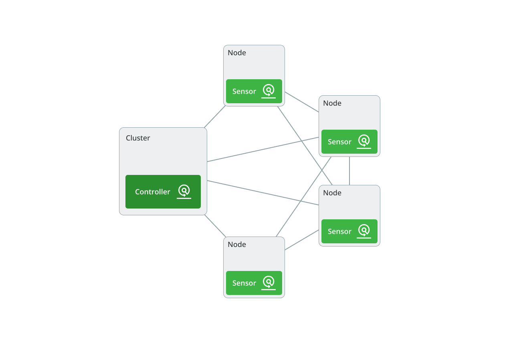
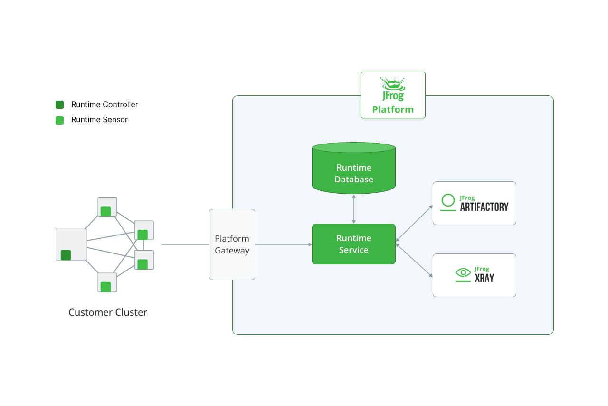

# Solution Architecture

JFrog Runtime is divided into two main areas: the JFrog Platform Cluster, where the runtime service, UI, and database are running, and the Customer Clusters, where a set of dedicated runtime sensors are installed and operating. While the JFrog Runtime platform components are integrated into the general JFrog Platform and communicate with additional components such as Artifactory and Xray, the runtime sensors monitor the customer clusters, collect runtime information, and send it to the Runtime Service within the JFrog Platform for further analysis and enrichment.

<figure><figcaption></figcaption></figure>

There are two types of modes, each designed to gather specific information from the customer environment. The Runtime Sensor is responsible for collecting runtime data, which, in the context of a Kubernetes environment, pertains to the container runtime. As such, it is installed on each cluster node and monitors the runtime behavior within the containers operating on that node. The Kubernetes Controller is responsible for gathering cluster-related information. Together, these modes offer comprehensive visibility into the user's cluster.

<figure><figcaption></figcaption></figure>

### &#x20;Runtime Sensor


Runtime Sensor is purchased in addition to the Controller (Runtime Impact). This entitlement provides clients with a runtime configuration option for sensors that can be acquired. If the number of nodes in operation exceeds the entitlement, the platform will promptly restrict the service.

&#x20;


The Runtime Sensor is responsible for tracking container runtime behavior on a node and sending this information to the runtime service in the platform. The sensor achieves this by monitoring kernel activity and detecting the execution of processes, as well as the loading of files using eBPF technology. It also collects information about the processes, the files accessed by them, and the container running the process.

Sensors are deployed using a Kubernetes DaemonSet, which installs a Sensor Pod with host privileges on each node. The Sensor sends information about processes and the container that executes the processes, but the main responsibility for delivering information on containers lies with the Controller.

As shown in the diagram, communication between customer clusters and the JFrog Platform is facilitated through secure gRPC connections. Employing gRPC provides advantages such as efficient data transmission and low latency.

In contrast to REST requests in the JFrog Platform, which are initially directed to Artifactory and subsequently routed to their designated service, runtime gRPC messages arriving at the JFrog Platform are directly forwarded to the Runtime service. The router supports gRPC, so in production environments, the gRPC messages will be forwarded through the Artifactory router > Runtime router and then to the Runtime-Service.

### Controller


This default option Runtime Integrity is tailored for users purchasing the E++ bundle, which includes Curation+Xray+JFrog Advanced Security+Runtime (controller only).&#x20;


The Runtime Controller is responsible for tracking Kubernetes cluster behavior and sending this information to the runtime service in the platform. The controller achieves this by monitoring cluster activity and detecting the execution of Kubernetes resources such as Pods, Workloads, and Nodes.\

Controllers are deployed as Kubernetes Deployments and are installed once per cluster.

### Platform Runtime Service

The Runtime Service is a standard JFrog Platform service with an adjacent router that supports message routing across the JFrog Platform. The service also manages the runtime MFE that implements the Runtime-related user interface. The Runtime service uses a persistent Runtime Postgres database to store and retrieve runtime data.

The Runtime Service integrates runtime information with data from Artifactory and Xray, enabling the identification of artifacts, pinpointing the location in the Artifactory registry where these artifacts are stored, and combining security information provided by Xray. This offers additional insights into the security status of the runtime artifacts, such as images, processes, and files detected in the runtime environment.

<figure><figcaption></figcaption></figure>

\
\
